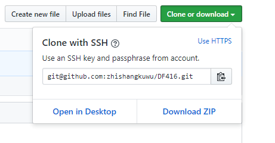

# 日常操作 #

### 1.fork

例如： 在我们的工作组 ***dl416*** ，仓库为 ***DF416*** ，点击右上角的 **Fork** 将组中 **dl416** 复制到自己的 **github** 中

接下来回到自己的 github 账号下，就能找到同名的仓库 ***DF416***

### 2.本地（clone）

接下来就是把 github DF416 放到本地的仓库，也就是放到自己的电脑上

* git clone [DF416所在的地址]

(主要本地的git其他常用指令)

* git add [新添加文件到暂存区]

* git commit[提交文件到仓库]

* git pull  --rebase[获取远程 github ]

* git push +连接名 +分支名

* git status[当前状态]

* git remote -v[查看当前连接]

  

* git log[日志查看]

### 3.pull request

通过本地 push 到自己的 github 下的 DL416 后，组内的 DL416 未能同步，通过 pull request 请求，等其他人 review 后进行 Merge 进行组内更新

### 4.推荐工具
**TortoiseGit**
